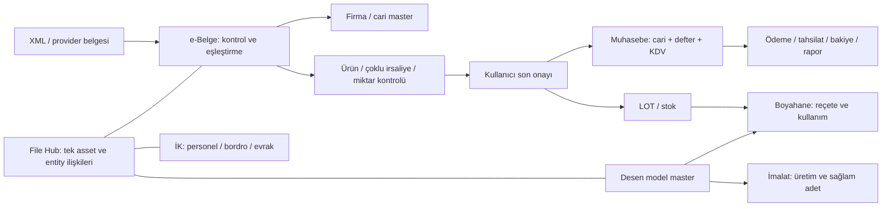

# KY ERP — Son kabul ve işlem haritası

Çalışma branch'i: `codex/final-acceptance-erp-20260928`.
Başlangıç production SHA: `1c4039753b97e438e7e3137a0fceab968f8d34c8`.
Durum: **İnceleme ve revizyon sürüyor; henüz production kabulü değil.**

## Ortak iş akışı

## Menü ve sahiplik

| Sıra | Modül / ekranlar | İşlemin sahibi ve kabul ölçütü |
|---|---|---|
| 1 | Muhasebe: Yönetim Özeti; Firmalar & Cari; Alış & Tedarikçi; Satış & Müşteri; Finans İşlemleri; Ekstre & Mail; Mali Kontrol & Raporlar | Tek cari master; belge kaynağı e-Belge; ödeme ve rapor aynı bakiye modelini kullanır. |
| 2 | e-Belge: Genel Bakış; Gelen; Giden; Havuz; Eşleştirmeler; Onay & Sorunlar; İş Akışları; Arşiv & Çıktı; Entegrasyonlar | XML ana kaynak; son onay tek posting akışı; resmî gönderim ayrı açık kullanıcı işlemi. |
| 3 | İK: Özet; Personel Kartları; Maaş / Yol / Banka / Elden; Mesai / Avans / Kesinti; Yıllık İzin; Bordro & Ödeme; SGK / Evrak / Ay Sonu | HKN personel master; SGK/PDKS koşulu olmadan aylık çalışan; kilitli dönem sabit bordro. |
| 4 | PDKS | Cihaz/desktop entegrasyonu kapsam dışı. Mevcut Günlük Operasyon yalnız regression. |
| 5 | Desen: Gelen; Havuz; Yerleşim / Kalıp; Raporlar | Model master ve revizyon; File Hub üzerinden kaynak / yerleşim / giden dosya. |
| 6 | Boyahane: Ana Ekran; İmalat Boyaları; Numune; Kayıtlı Renkler; Stok / LOT; Raporlar | Belgeden LOT'a, reçeteden kullanıma geriye izlenebilirlik. |
| 7 | İmalat: Üretim Merkezi; Raporlar; Makine & Vardiya | Brüt − baskı sakatı − kumaş sakatı; düzeltme geçmişi korunur. |
| 8 | Mail & Dosyalar: Gelen; Sabitlenen; Gönderilmiş; Taslaklar; Yanıt Bekleyen; Şablonlar; Dosyalar | Günlük kullanım; tenant ve mailbox üyeliği; belirsiz gönderim otomatik tekrarlanmaz. |
| 9 | Denetim: Özet; Evrak; Takvim; CAPA; Standartlar; Ayarlar | Bulgu → aksiyon → sorumlu → termin → kapanış kanıtı. |
| 10 | Bağlantılar: Özet; Dosya Servisleri; E-posta Hesapları; Atamalar; İndeks; Senkron; Yedek / Log | Yönetim yüzeyi; gerçek provider readiness ve hata / son senkron bilgisi. |
| 11–13 | Sistem Merkezi; Platform Yönetimi; Asistan | Mevcut yetki, MFA, step-up ve allowlist korunur. |

## Doğrulama kaydı

- Canlı Yönetim Özeti ve Firmalar & Cari salt okunur açıldı.
- Firma detayının yanlış modal semantiği ortak pencere sistemini tetikliyor; eski CSS katmanları minimum 520–690 px yükseklik ve gizlenen filtreler içeriyor.
- Firma listesi / detay düzeni tek kaynakta sadeleştiriliyor; geciken API yanıtı ve tenant değişimi korunuyor.
- Yeni cari işlem POST rotası eksik; ödeme rotasının bakiye yönü trigger düzeltmesine bağımlı. Ortak atomik kayıt ve işlem kimliği üzerinde düzeltme sürüyor.
- Başlangıç frontend: 188 test başarılı. İlk UI revizyonu: lint ve production build başarılı.
- Başlangıç Worker: typecheck başarılı; 462 testten 461 başarılı. Tek hata eski Bağlantılar menü etiketine bağlı kontrat; güncel canonical isimle hizalanıyor.
- Son kapı: hedefli davranış testleri, bütün testler, lint/build, Worker local integration ve dry-run, üç masaüstü boyutu + dokunmatik, PR/merge, Pages + Worker ve salt okunur canlı smoke.

Gerçek kayıtlarda test amaçlı yazma, migration, dış mail veya resmî belge gönderimi yapılmaz.
